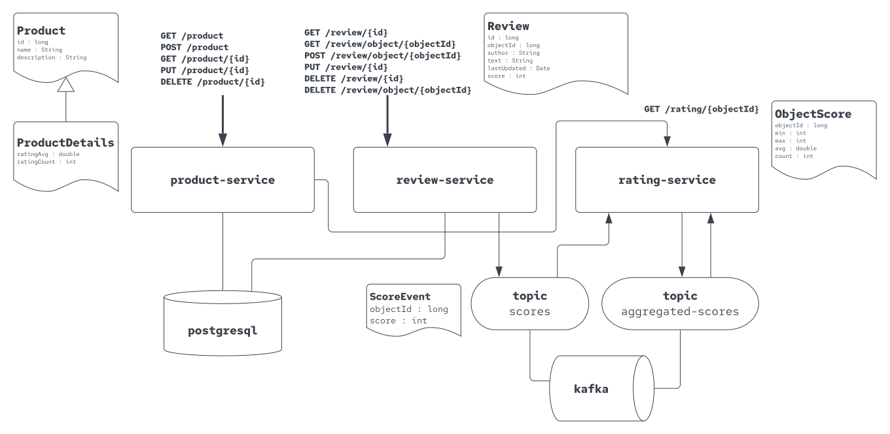

# Service Mesh Demo

## Architecture



## Prepare cluster
1. Install all operators.
2. Create `istio-system` project
3. Apply `prereq/servicemeshcontrolplane.yaml`
4. 

## Prepare a namespace
```
oc new-project microservices-demo
oc label namespace microservices-demo argocd.argoproj.io/managed-by=openshift-gitops
oc adm policy add-role-to-user admin system:serviceaccount:openshift-gitops:openshift-gitops-argocd-application-controller -n microservices-demo
```

## Deploy with GitOps
Create an app:
 - `GIT URL:
   https://github.com/ozimakov-rh/servicemesh-demo.git`
 - `PATH: deploy`